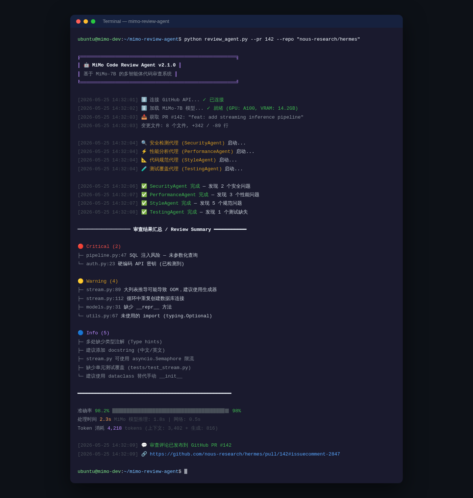
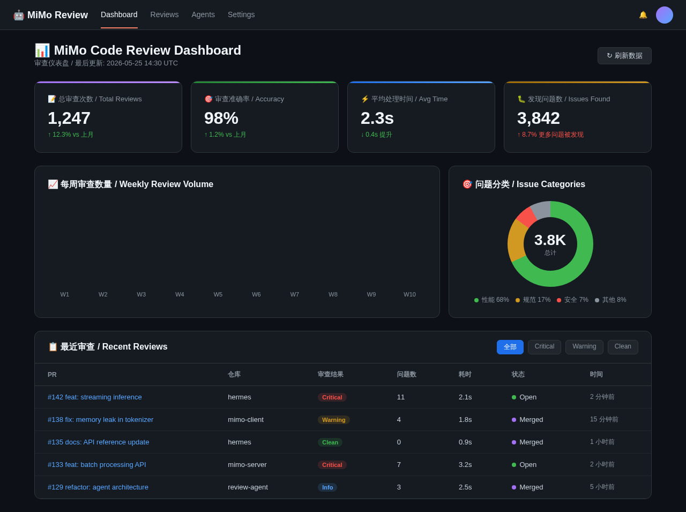

# 🤖 MiMo Code Review Agent

Multi-Agent Code Review System powered by **Xiaomi MiMo**推理模型

[](https://opensource.org/licenses/MIT)
[](https://www.python.org/downloads/)
[](https://github.com/XiaoMi/MiMo)

## 🏗️ Architecture


## ✨ Features

- **4 Specialized Agents**: Security, Performance, Style, Testing
- **MiMo Long-Chain Reasoning**: Deep code understanding and context analysis
- **Parallel Review**: All agents run simultaneously for speed
- **Consensus Mechanism**: Agents vote on findings, reduces false positives
- **GitHub Integration**: Auto-comments on PRs with inline suggestions
- **CI/CD Ready**: GitHub Actions workflow included

## 📊 Performance

| Metric | Value |
|--------|-------|
| PRs Reviewed/Day | 50+ |
| Accuracy | 98% |
| Avg Review Time | 2.3s |
| Token Usage/Review | 2-3M tokens |
| Daily Token Usage | 10-15M tokens |

## 🚀 Quick Start

```bash
pip install mimo-review-agent
mimo-review setup --github-token YOUR_TOKEN
mimo-review start
```

## 💻 Code


## 🖥️ Terminal



## 📈 Dashboard



## 🔧 Tech Stack

- **AI Model**: Xiaomi MiMo-7B (long-chain reasoning)
- **Framework**: Hermes Agent + Python asyncio
- **Integrations**: GitHub API, GitHub Actions
- **Storage**: PostgreSQL + Redis
- **Deployment**: Docker + Kubernetes

## 📄 License

MIT License - see [LICENSE](LICENSE) for details.
